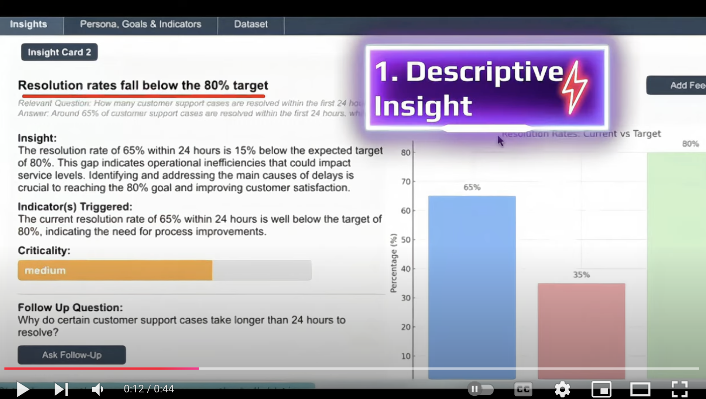
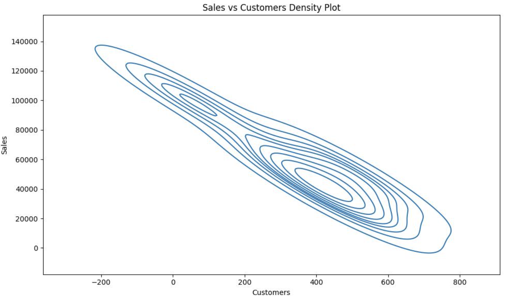
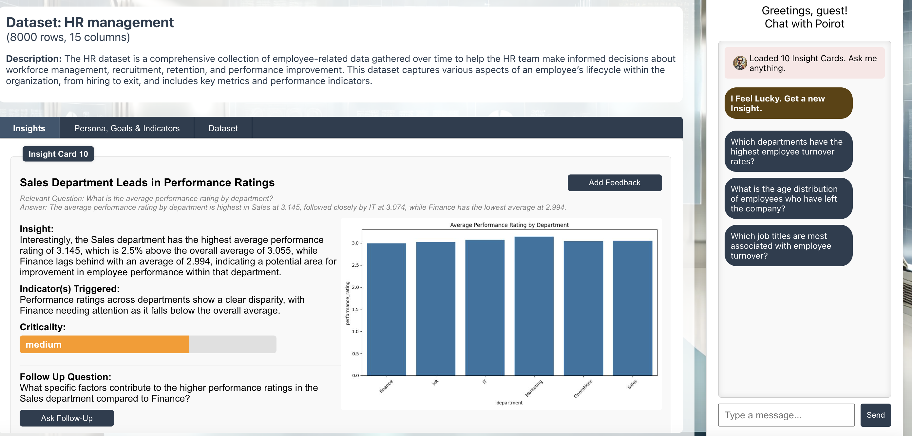

## AgentPoirot: A Comprehensive Data Analytics Agent for Extracting Actionable Insights

<center>

</center>

**Agent Poirot** is a comprehensive data analytics agent capable of extracting actionable, interesting, surprising insights tailored to user's goals and persona. 

- It can recommend diverse questions, ask follow up questions, answer complex analytics questions, generate context-specific insights that can be descriptive, diagnostic, predictive and prescriptive in order to achieve user's goal. 

- Join our [Discord](https://discord.gg/M7FHPetW4g) to discuss and collaborate with the Agent Poirot community

- Apply for an internship here to collaborate with us on extensions of this work: https://forms.gle/NFD5PamNu1yCzbxy8

## Demo (Video)

[](https://www.youtube.com/watch?v=TZx-_8FFjKc)


### 📥 Install Library

```bash
pip install --upgrade git+https://github.com/ServiceNow/agent-poirot
```

### 🚀 Usage

#### 1. Get Insights

```python
import pandas as pd
import agentpoirot


# Load Data
sales_by_country = pd.DataFrame(
    {
        "State": ["California", "Texas", "Florida", "New York", "Alaska"],
        "Sales": [50000, 45000, 40000, 42000, 100000],
        "Customers": [
            500,
            450,
            400,
            420,
            50,
        ],
    }
)

# set your openai api key
# os.environ["OPENAI_API_KEY"] = "YOUR_API_KEY"

# Get Agent
agent = agentpoirot.Poirot(
    table=sales_by_country,
    model_name="gpt-4o-mini",
    meta_dict={
        "goal": "find surprising insights in terms of how factors are correlated",
    },
)

# Generate Insights
insights = agent.generate_insights(n_insights=1, as_str=True)
print(insights)
```

#### Output:
```
# Insight 1
## Header
-----------
Inverse correlation between sales and customers observed

## Question
-----------
How do sales correlate with the number of customers across different states?

## Answer
-----------
Sales and customer numbers show a surprising inverse correlation in some states.

## Insight
-----------
In California, with 500 customers, sales are at $50,000, while in Alaska, only 50 customers lead to an unexpected spike in sales to $100,000, indicating a potential anomaly in customer purchasing behavior that could warrant further investigation.

## Severity
-----------
medium

## Follow up
-----------
What is the average sales per customer for each state?
```

#### Plot:


#### 2. Ask Questions and Get Insight

A question can also be asked to the agent and the agent will generate an insight.

```python
question = "What is an interesting trend between these countries?"
insights = agent.answer_question(question=question)
print(insights)
```

#### 3. Run main.py to generate insights for a dataset

```bash
python main.py --dataset_name <dataset_name> 
               --model_name <model_name>
               --openai_api_key <openai_api_key>
               --savedir_base <savedir_base>
```

## 2. Run  Web App
```
cd web
python app.py
```
**Expected Output:**

<center>

</center>


## Resources

- [insight-bench](https://arxiv.org/abs/2407.06423) for the relevant paper
- [Discord](https://discord.gg/M7FHPetW4g) for discussion with the Agent Poirot community
- [ServiceNow Internship Form](https://forms.gle/NFD5PamNu1yCzbxy8) for collaboration

## Citation

```bibtex
@article{sahu2024insightbench,
  title={InsightBench: Evaluating Business Analytics Agents Through Multi-Step Insight Generation},
  author={Sahu, Gaurav and Puri, Abhay and Rodriguez, Juan and Abaskohi, Amirhossein and Chegini, Mohammad and Drouin, Alexandre and Taslakian, Perouz and Zantedeschi, Valentina and Lacoste, Alexandre and Vazquez, David and Chapados, Nicolas and Pal, Christopher and others},
  journal={arXiv preprint arXiv:2407.06423},
  year={2024}
}

```

## 🤝 Contributing
Please check the outstanding issues and feel free to open a pull request.
For more information, please check out the [contributing guidelines](CONTRIBUTING.md) and [issue template](ISSUE_TEMPLATE.md).


### Thank you!

<!-- [](https://github.com/ServiceNow/agent-poirot/graphs/contributors) -->
